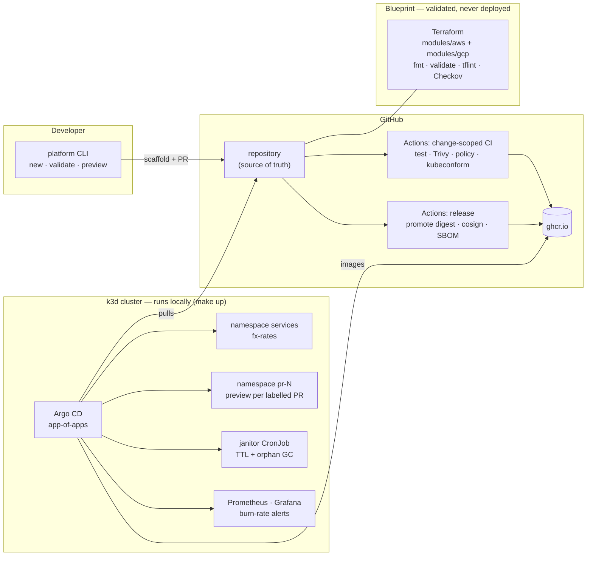

# Paved Road

A reference internal developer platform that runs on your laptop in one
command — golden-path scaffolding, digest-promotion CI/CD, ephemeral preview
environments, SLO-driven alerting, and policy-checked Terraform for AWS and
GCP.

[](https://github.com/Acr86/paved-road/actions/workflows/ci.yml)
[](https://github.com/Acr86/paved-road/actions/workflows/terraform.yml)
[](LICENSE)

## What is this

Paved Road is a working reference implementation of an internal developer
platform — the *paved road* a product team takes by default to go from "I need
a new service" to "it is deployed, observed, and safe to change". The core runs
entirely on a laptop — service catalog, scaffolder, CI/CD pipeline, preview
environments, dashboards and burn-rate alerts — with no cloud account required. The cloud-facing layers (Terraform for AWS and
GCP) ship as blueprints that pass the same gates code does, with the
reasoning recorded in ADRs. It is opinionated by design: every choice here is
one I would defend in a design review, and most are written down in
[docs/adr/](docs/adr/).

## Architecture



## Run it in five minutes

Prerequisites: Docker (8 GB allocated), [k3d](https://k3d.io),
kubectl, [uv](https://docs.astral.sh/uv/), make.

```bash
git clone https://github.com/Acr86/paved-road && cd paved-road
make doctor        # verify the tools above
make up            # k3d cluster + Argo CD + the root app (~5-8 min first run)
make demo          # scaffold a service and walk it onto the platform
```

You will see a freshly scaffolded service pass its own tests, deploy through
the platform ingress, and appear in the catalog — the same golden path a real
change takes through CI. Tear everything down with `make down` (and
`make demo-clean` for the demo artifacts).

## What runs vs. what is designed

**Runnable.** The local platform — catalog, CLI, GitOps, previews, janitor,
observability — executes on your machine and is exercised by this
repository's own CI on every relevant change (the `e2e-bootstrap` job runs
the same `make up` you do). If the badge above is green, the quickstart
works.

**Blueprint.** Everything under [infra/terraform/](infra/terraform/) is
validated, never deployed: it passes `fmt`, `validate`, tflint and a clean
Checkov run in CI, but no cloud resources are created, by design.
[ADR-0002](docs/adr/0002-runnable-core-validated-blueprint.md) explains the
split; each blueprint states what going live would take.

Anything this repository claims, you can verify with a command listed in
[docs/capabilities.md](docs/capabilities.md).

## Capabilities

| Area | What exists | Status |
|---|---|---|
| Developer self-service | One-pass scaffolding (service + manifests + catalog entry), catalog that cannot drift from the repo | runnable |
| Delivery | Change-scoped CI, Trivy and policy gates, promote-by-digest releases with keyless signing and SBOMs | runnable |
| Preview environments | Complete environment per labelled PR, TTL + orphan garbage collection | runnable |
| Observability | Dashboards as code, multi-window burn-rate SLO alerts, every alert links its runbook | runnable |
| Infrastructure | Mirrored AWS/GCP Terraform module contracts, keyless OIDC identity, WORM audit archives | blueprint |
| Operational intelligence | Rules-first CI failure triage with optional LLM summaries | runnable |

The full map with verification commands: [docs/capabilities.md](docs/capabilities.md).

## The golden path, end to end

```text
$ make demo

==> 1/6 scaffold a new service from the golden path
created services/demo-ledger
created deploy/kustomize/services/demo-ledger
created catalog/demo-ledger.yaml

==> 2/6 the generated service's own test suite passes
4 passed in 0.81s

==> 3/6 the catalog stays consistent (the same gate CI enforces)
ok catalog is consistent (4 entries)

==> 4/6 build and deploy to the local cluster
deployment "demo-ledger" successfully rolled out
==> demo-ledger is live: http://demo-ledger.127.0.0.1.nip.io:8080/

==> 5/6 the service answers through the platform ingress
{"status":"ok"}
{"service":"demo-ledger","owner":"team-demo","version":"dev"}

==> 6/6 it is in the catalog
```

In the real flow, step 4 onward is a pull request: CI builds and scans the
image, the `preview` label spawns namespace `pr-N` with its own URL, and
merging promotes the exact tested digest — no rebuild
([ADR-0005](docs/adr/0005-build-once-promote-by-digest.md)). Rolling back is
re-pointing a tag at the previous signed digest
([RB-003](docs/runbooks/rb-003-rollback.md), three commands).

## Repository tour

| Path | What lives there |
|---|---|
| [platform-cli/](platform-cli/) | The `platform` CLI: scaffold, validate, previews. Also the janitor's container image |
| [templates/fastapi-service/](templates/fastapi-service/) | The golden-path template (Copier): one render produces service, manifests and catalog entry |
| [services/fx-rates/](services/fx-rates/) | Reference service, generated from the template — provenance in `.copier-answers.yml` |
| [catalog/](catalog/) | The service catalog; `platform validate` keeps it honest in CI |
| [deploy/argocd/](deploy/argocd/) | App-of-apps: service generator, preview PR generator, platform system |
| [observability/](observability/) | Dashboards and alert rules as code |
| [policy/kubernetes/](policy/kubernetes/) | Rego policies for every rendered manifest — themselves unit-tested |
| [infra/terraform/](infra/terraform/) | The multi-cloud blueprint: mirrored AWS/GCP modules and env compositions |
| [aiops/ci-triage/](aiops/ci-triage/) | CI failure classifier: deterministic rules, fixtures-tested, optional LLM summary |
| [docs/](docs/) | ADRs, runbooks, SLOs, capability map, Backstage migration path |

## Design decisions

Thirteen ADRs record the load-bearing choices — each names a real rejected
alternative and at least one consequence that hurts. Start with:

- [0002 — Runnable core, validated blueprint](docs/adr/0002-runnable-core-validated-blueprint.md)
- [0005 — Build once, promote by digest](docs/adr/0005-build-once-promote-by-digest.md)
- [0009 — Previews: ApplicationSet + TTL janitor](docs/adr/0009-previews-applicationset-ttl-janitor.md)
- [0011 — Provider-neutral contracts, AWS and GCP](docs/adr/0011-provider-neutral-contracts-aws-gcp.md)
- [0012 — Evidence is generated, not maintained](docs/adr/0012-evidence-generated-not-maintained.md)

Full index in [docs/adr/](docs/adr/).

## Documentation

- [Capability map](docs/capabilities.md) — claim → location → status → how to verify
- [SLOs and burn-rate alerting](docs/slo.md)
- [Runbooks](docs/runbooks/) — linked from every alert's `runbook_url`
- [The platform as a product](docs/platform-as-product.md) — personas, golden-path metrics, feedback loops
- [Backstage migration path](docs/backstage-migration.md) — the catalog is deliberately Backstage-shaped

## Out of scope, deliberately

A production deployment adds things this reference intentionally omits: log
aggregation, progressive delivery with metric-driven rollback, in-cluster
secret management, multi-node scheduling with quotas, real paging
integration. Each omission and its production answer is recorded in
[ADR-0013](docs/adr/0013-scope-boundaries.md) — they are scoping decisions,
not gaps discovered later.

## About this project

Paved Road distills several years of designing and operating the delivery
platform for a regulated fintech, where I built the paved road end to end:
pipeline quality gates, build-once/promote-by-digest releases, keyless OIDC
authentication to cloud providers, a Terraform module library with drift
detection, and compliance evidence generated by the pipeline rather than
maintained by hand. This repository is a clean-room reference implementation
of those patterns — no employer code, no proprietary domain — rebuilt to be
cloud-portable and runnable on a laptop, so the ideas can be examined,
executed, and argued with. If a decision looks opinionated, there is probably
an ADR explaining what it cost to learn.

## License

[MIT](LICENSE)
